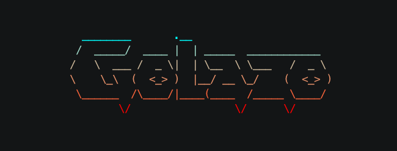

<div align="center">
  
  <h1>Golazo</h1>
</div>

<div align="center">

[](https://opensource.org/licenses/MIT)
[](https://goreportcard.com/report/github.com/0xjuanma/golazo)
[](https://github.com/0xjuanma/golazo/releases/latest)
[](https://github.com/0xjuanma/golazo/actions/workflows/build.yml)

A minimalist terminal user interface (TUI) for following football(i.e, soccer) matches in real-time. Get live match updates, finished match statistics, and minute-by-minute events directly in your terminal.

Golazo was created for those moments when you can't stream or watch matches live. It gives you a handy, non-intrusive, and minimalist way to keep up with your favourite football leagues.
</div>

> [!NOTE]
> If you enjoy Golazo, give it a star and share it with your friends. That helps others find it and keeps the project going!

<div align="center">
  
</div>

## Features

- **Live Match Tracking**: Timeline & Real-time updates for goals, cards, and substitutions with automatic polling
- **Match Statistics**: Detailed stats including possession, shots, and passes
- **Goal Notifications & Replay Links**:  Desktop notifications & clickable links to goal replays
- **Finished Matches**: View results from today, last 3 days, or last 5 days
- **50+ Leagues**: Support for major leagues across Europe, Americas, Asia, and more. Select your favorite leagues in Settings

## Installation/Update

> [!IMPORTANT]
> As of v0.6.0, you can update golazo to the latest version by running:
> ```bash
> golazo --update
> ```

### Using the install/update script (recommended)

**macOS / Linux:**
```bash
curl -fsSL https://raw.githubusercontent.com/0xjuanma/golazo/main/scripts/install.sh | bash
```

**Windows (PowerShell):**
```powershellq
irm https://raw.githubusercontent.com/0xjuanma/golazo/main/scripts/install.ps1 | iex
```

### Build from source

```bash
git clone https://github.com/0xjuanma/golazo.git
cd golazo
go build 
./golazo
```

## Usage

Run the application:
```bash
golazo
```

## Supported Leagues

Many leagues and competitions across Europe, South America, North America, Middle East, and more. [View full list](docs/SUPPORTED_LEAGUES.md)

Customize your leagues and competitions preferences in the **Settings** menu.

## Notification Setup

Goal notifications require one-time setup depending on your operating system.

### macOS

Notifications use AppleScript, which requires enabling notifications for Script Editor:

1. Open **Script Editor** (`/Applications/Utilities/Script Editor.app`)
2. Paste and run: `display notification "test" with title "test"`
3. Open **System Settings → Notifications → Script Editor**
4. Enable/Allow notifications and set alert style to "Banners"

### Linux

Notifications require `libnotify`. Install if not present:

```bash
# Debian/Ubuntu
sudo apt install libnotify-bin

# Fedora
sudo dnf install libnotify

# Arch
sudo pacman -S libnotify
```

### Windows

Notifications should work out-of-box on Windows 10/11.

---

Powered by [Cobra](https://github.com/spf13/cobra) & the glamorous [Charmbracelet](https://github.com/charmbracelet).

**Author:** [@0xjuanma](https://github.com/0xjuanma)
